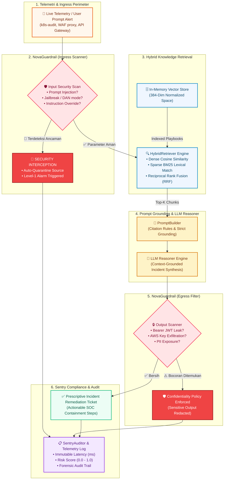

<div align="center">


<br/>

[](https://www.rust-lang.org/)
[](https://github.com/tokio-rs/axum)
[](https://tailwindcss.com/)
[](https://tokio.rs/)
[](#)
[](LICENSE)

<p align="center">
  <b>Autonomous Multi-Agent AI RAG Security Sentry &amp; Guardrail Engine in Rust</b><br/>
  Featuring an Interactive n8n-Style Workflow Graph, Dual Perimeter Scanning, and Hybrid Vector Knowledge Grounding
</p>

</div>

---

## 📖 Ringkasan Proyek (Overview)

**NovaSentry** adalah sistem pengawal keamanan (*security sentry*) dan inteligensi berbasis **AI RAG (Retrieval-Augmented Generation)** otonom berkinerja tinggi yang ditulis dalam bahasa pemrograman **Rust**. Sistem ini dirancang untuk memantau telemetri keamanan kluster secara real-time, mencegat manipulasi prompt injeksi (*prompt injection attack*), serta menghasilkan analisis triage insiden yang berlandaskan pada *runbooks* dan *advisories* organisasi yang terverifikasi.

Pada iterasi ini, NovaSentry dilengkapi dengan **Tailwind CSS SOC Sentinel Web Dashboard** beraksen gradasi **Carrot Orange** (`#ea580c` ➔ `#f97316` ➔ `#fb923c`), fitur **n8n-Style Realtime Flow Visualizer** dengan garis kabel animasi dan *dot-mesh background*, serta **Dark/Light Theme Toggle** yang diterapkan secara presisi ke seluruh komponen kartu (*cards*), formulir, tabel audit, dan kanvas node graph.

---

## 🏛️ Arsitektur Alur Sistem (Mermaid Flow Diagram)

Berikut adalah diagram alur visual menyeluruh dari siklus pemeriksaan telemetri, penyaringan perimeter ganda, dan sintesis mitigasi RAG:



---

## ⚡ Fitur Utama (Key Features)

### 1. 🎛️ n8n-Style Realtime Flow Visualizer
- **Interactive Node Graph Workspace**: Kanvas node graph dengan *dot-mesh background* (`mesh-bg-dark` / `mesh-bg-light`).
- **Garis Koneksi Animasi (Animated Pulse Wires)**: Kabel busur kurva Bezier SVG dengan animasi aliran pulsa (`wire-active` dash-offset) yang memvisualisasikan paket data bergerak antar node.
- **Node State Dinamis**: Node berubah warna secara real-time (`PASSED` ➔ hijau berpendar, `BLOCKED` ➔ merah alarm darurat, `PROCESSING` ➔ gradasi oranye menyala).
- **Simulasi Interaktif 1-Klik**: Tombol simulasi instan untuk mengamati respons sistem terhadap *Legitimate Flow* vs *Adversarial Interception*.

### 2. 🎨 UI/UX Redesign dengan Carrot Orange Accent & Theme Toggle
- **Sidebar Navigasi Modern**: Tata letak enterprise ala Datadog/CrowdStrike dengan pemisahan menu yang rapi (Dashboard, Flow Visualizer, Triage Lab, Vector Runbooks, Guardrail Lab, Audit Log).
- **Toggle Mode Gelap & Terang (Dark / Light)**:
  - Mode Gelap: Latar hitam cyber (`#07090e`) dengan kartu *deep glassmorphism* (`#0f1422`).
  - Mode Terang: Latar bersih sejuk (`#f8fafc`) dengan kartu putih elegan dan bayangan halus.
  - Teraplikasi secara menyeluruh ke seluruh kartu, input form, tabel audit, dan teks. Preferensi disimpan otomatis di `localStorage`.
- **Aksen Gradasi Carrot Orange**: Warna primer oranye wortel (`#ea580c` ➔ `#f97316` ➔ `#fb923c`) melambangkan kewaspadaan (*alertness*) dan ketangkasan sentri.

### 3. 🛡️ Dual-Perimeter Guardrail Engine (`NovaGuardrail`)
- **Ingress Scanner**: Memeriksa seluruh muatan teks dan telemetri sensor sebelum menyentuh model LLM. Mencegah manipulasi sistem prompt, *DAN mode*, pembocoran prompt tersembunyi, dan *policy bypass*.
- **Egress Scanner**: Memindai output teks hasil sintesis model terhadap kebocoran token autentikasi (JWT Bearer, kunci privat SSH/RSA, AWS access keys).

### 4. 🔍 Hybrid RAG Knowledge Retrieval (`HybridRetriever`)
- Memadukan penelusuran semantik vektor padat 384-D (Cosine Similarity) dengan pencocokan leksikal jarang (*BM25-like*).
- Menggunakan algoritma **Reciprocal Rank Fusion (RRF)** untuk menyatukan peringkat dokumen sehingga menghasilkan konteks rujukan CVE/Runbook yang paling presisi.

### 5. 📚 Ingestor Playbook & Vector Store Otonom
- Pemotongan dokumen teks menggunakan [`RecursiveCharacterChunker`](src/components/chunker.rs) dengan ukuran *window* dan *overlap* adaptif.
- Pengindeksan vektor instan ke dalam [`InMemoryVectorStore`](src/components/vector_store.rs) yang aman dari *data-race* (*thread-safe read/write*).

### 6. 📋 Jejak Audit Kepatuhan & Forensik (`SentryAuditor`)
- Log kepatuhan *in-memory* yang mencatat stempel waktu UTC, judul insiden, status kelolosan perimeter, skor risiko numerik, dan waktu pemrosesan (*latency*) dalam milidetik.

---

## 🧩 Kontrak Modular Traits (Rust Architecture)

Arsitektur NovaSentry bersifat sepenuhnya lepas-pasang (*loosely coupled*) berkat trait asinkron Rust pada [`src/core/traits.rs`](src/core/traits.rs):

| Trait | Tanggung Jawab Komponen | Implementasi Bawaan |
|---|---|---|
| `Chunker` | Pemartisian dokumen panjang & penjagaan batas semantik | `RecursiveCharacterChunker` |
| `Embedder` | Transformasi teks menjadi vektor padat 384 dimensi | `MockEmbedder` (Normalized Hashing Space) |
| `VectorStore` | Pengindeksan & pencarian kemiripan kosinus thread-safe | `InMemoryVectorStore` |
| `Retriever` | Penelusuran gabungan Dense + Sparse (RRF Fusion) | `HybridRetriever` |
| `LlmClient` | Penalaran dan sintesis tiket investigasi tergrounding | `MockLlmGenerator` (`NovaSentry-Reasoner-v1`) |
| `GuardrailValidator` | Pemindaian injeksi ingress & penapisan kebocoran egress | `NovaGuardrail` |
| `SentryAuditor` | Pencatatan riwayat audit telemetri & analisis kepatuhan | `SentryAuditor` |

---

## 🚀 Panduan Memulai Cepat (Quickstart)

### 1. Jalankan Web Dashboard (Bawaan)

Jalankan server Axum dan buka antarmuka WebUI di peramban web:

```bash
cargo run
```

Buka URL di browser: **`http://localhost:3000`** (atau `http://127.0.0.1:3000`).

Opsi port kustom:
```bash
cargo run -- --port 8080
```

### 2. Jalankan Mode Demo Terminal (Headless CLI)

Jika ingin menjalankan simulasi uji coba di konsol terminal tanpa server web:

```bash
cargo run -- --demo
```

### 3. Jalankan Pengujian (Test Suite)

Jalankan seluruh rangkaian tes komponen dan integrasi:

```bash
cargo test
```

---

## 🔌 Dokumentasi REST API

| Method | Endpoint | Deskripsi |
|---|---|---|
| `GET` | `/` | Menyajikan antarmuka Single Page Application (Tailwind SOC Dashboard) |
| `GET` | `/api/stats` | Mengambil metrik sistem (jumlah chunk, total audit, dimensi vektor, model) |
| `GET` | `/api/knowledge` | Mengambil seluruh daftar chunk pengetahuan di dalam basis data vektor |
| `POST` | `/api/knowledge` | Melakukan chunking dan pengindeksan playbook / CVE baru |
| `POST` | `/api/investigate` | Mengirim telemetri untuk dianalisis oleh pipeline RAG & Guardrail |
| `GET` | `/api/audit` | Mengambil riwayat catatan kepatuhan dan audit forensic |
| `POST` | `/api/guardrail/test` | Pengujian mandiri aturan guardrail ingress atau egress |

### Contoh Pengujian Investigasi via cURL:

```bash
curl -X POST http://127.0.0.1:3000/api/investigate \
  -H "Content-Type: application/json" \
  -d '{
    "title": "ALERT-9042: Detected privilege escalation on auth-pod-worker-02",
    "severity": "Critical",
    "source": "k8s-audit-sensor-us-east-1",
    "raw_telemetry": "Process /bin/nsenter spawned with hostPID=true attempting memory dump of /etc/kubernetes/pki"
  }'
```

---

## 📄 Lisensi

Proyek ini dirilis di bawah lisensi ganda [MIT License](LICENSE) atau Apache-2.0.
